# Cohort Dashboard — Visualization Reference

This page documents **every visualization** on the **Cohort Dashboard** page, section by
section, in the same top-to-bottom order they appear on screen. For each plot you will find
what it shows, how it is built, how to read it, and which controls change it.

If you are looking for how to launch the dashboard, load a project, or run the analysis, see
[The DeepEcoHab Dashboard](dashboard.md) first — this page assumes a project is loaded and its
analysis has already been run.

## How to use this reference

Every plot reacts only to the controls it depends on; changing an unrelated control leaves it
untouched. Two kinds of controls exist:

- **Global settings bar** (pinned at the top of the Dashboard tab): **Phase**
  (All / Dark / Light), **Aggregation** (Sum / Mean), **Slider mode** (Range / Single),
  **Granularity** (Days / Phases), and the **day/phase slider**.
- **Per-section switches** (radio buttons placed just above the relevant plots): the
  *ranking*, *position*, *pairwise*, and *sociability* switches.

Each plot below lists a **Responds to** line naming exactly which of those controls affect it.
Two conventions are worth stating once here:

- **Granularity (Days vs. Phases).** The slider axis unit. In *Days* mode a "unit" is one
  24 h experiment day; in *Phases* mode a unit is one light or dark phase. Every plot that
  bins or slices by time honours this choice, so "day" in the descriptions below means
  "the selected time unit".
- **Aggregation (Sum vs. Mean).** When several days/phases are selected, *Sum* adds their
  values together while *Mean* averages them. *Mean* often switches a plot from bars to
  box plots (showing the spread across units) or adds SEM shading to a line. Aggregation is
  disabled in *Single* slider mode (one unit — nothing to aggregate).

Colors follow two schemes throughout: a per-animal categorical palette (sampled from the
`Phase` colormap, consistent for a given animal across every plot) and a sequential
**Viridis** scale for all heatmaps (dark = low, yellow = high).

---

## Cohort overview

### Animal feature overview (radar / polar plot)

A polar "radar" chart giving a one-glance behavioural fingerprint of every animal across all
the main metrics at once.

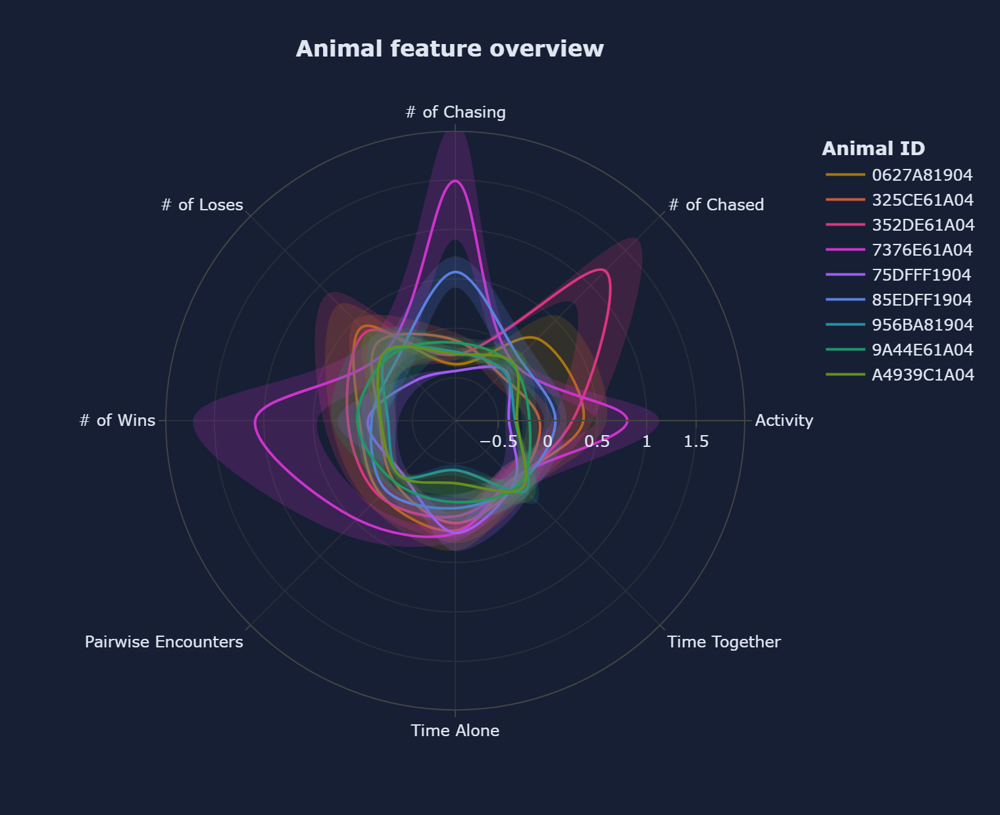

- **What it shows.** Each spoke of the radar is one behavioural metric, drawn from the
  z-scored **feature table**: `time_alone`, number of chasings given (`n_chasing`) and
  received (`n_chased`), tube-test wins (`n_wins`) and losses (`n_loses`), `activity`,
  `time_together`, and `pairwise_encounters`. Each metric is z-scored across the whole cohort,
  so a value of 0 is the cohort average, positive means above average, negative below.
- **How to read it.** One colored line per animal traces its profile around the circle. The
  shaded band around each line is the **SEM** across the selected days/phases — a wide band
  means that animal's value for that metric was inconsistent over the selected window. Animals
  whose lines sit consistently far from center are behavioural outliers; overlapping lines
  indicate similar profiles.
- **Responds to:** Phase, day/phase slider, Granularity. (Not Aggregation — it always shows
  the mean z-score with SEM shading.)

---

## Social hierarchy

The hierarchy section is controlled by the **ranking switch** (`In time` vs. `Day stability`),
which changes only the first plot. Chasing/tube-test define the "matches" the dominance model
is built from: whenever one animal chases another, the chaser is the winner and the chased the
loser.

### Social dominance ranking (ranking switch: *In time*)

A line plot of the **dominance ranking trajectory** over the experiment.

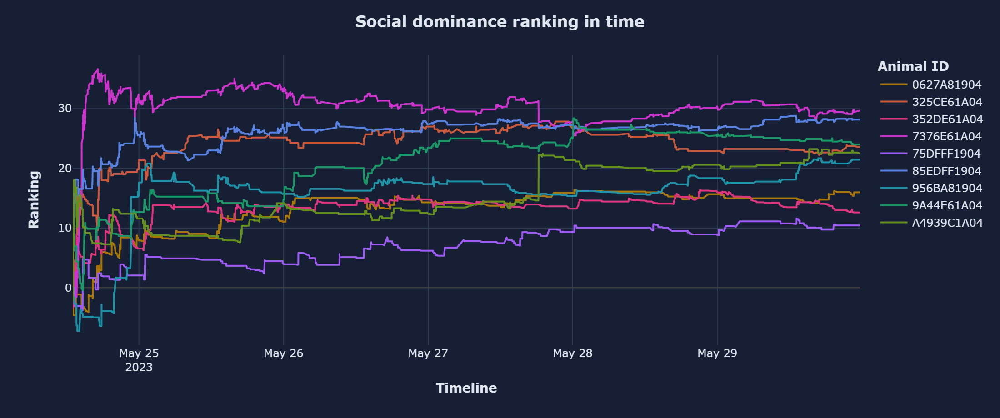

- **What it shows.** Dominance is estimated with a Plackett–Luce skill-rating model: every
  chasing event is replayed in chronological order as a one-on-one match (chaser beats chased),
  and each animal's rating is updated after every match. The plotted value is the model's
  **`ordinal`** score (a conservative skill estimate, roughly `mu − 3·sigma`); higher = more
  dominant.
- **How to read it.** The x-axis is the experiment timeline, the y-axis the ordinal score,
  one colored line per animal. Rising lines = animals climbing the hierarchy; lines that cross
  mark rank reversals; lines that flatten out mean the hierarchy has stabilized.
- **Responds to:** day/phase slider, Granularity, ranking switch. (Not Phase or Aggregation.)

### Dominance rank trajectories (ranking switch: *Day stability*)

The same social-hierarchy slot, switched to show **discrete rank per time unit** instead of the
continuous score.

- **What it shows.** For each day (or phase) the animals are ranked 1..N by their last ordinal
  score of that unit, and the rank is plotted over time. The y-axis is reversed so **rank 1
  (most dominant) sits at the top**.
- **How to read it.** Flat horizontal lines mean a stable hierarchy; frequent vertical jumps
  mean rank instability. This is the categorical, "who was on top each day" companion to the
  continuous *In time* view.
- **Responds to:** day/phase slider, Granularity, ranking switch.

### Ranking probability distribution

A line/area plot of each animal's **rating uncertainty** on the most recent selected unit.

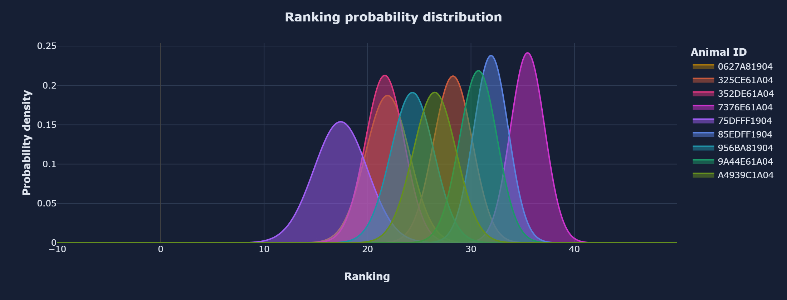

- **What it shows.** The skill model tracks each animal as a Gaussian with mean `mu` and spread
  `sigma`. This plot draws the fitted normal probability-density curve for every animal, using
  their `mu`/`sigma` from the last day/phase in the selected range.
- **How to read it.** The x-axis is the rating scale, the y-axis probability density. A curve's
  **peak position** is the animal's skill estimate; a **narrow, tall** curve means the model is
  confident about that animal, a **wide, flat** curve means high uncertainty. Well-separated
  curves indicate a clear hierarchy; heavily overlapping curves indicate ambiguous ranks.
- **Responds to:** day/phase slider, Granularity. (Not Phase or Aggregation.)

### Dominance network graph

A directed network summarizing the aggression structure of the cohort.

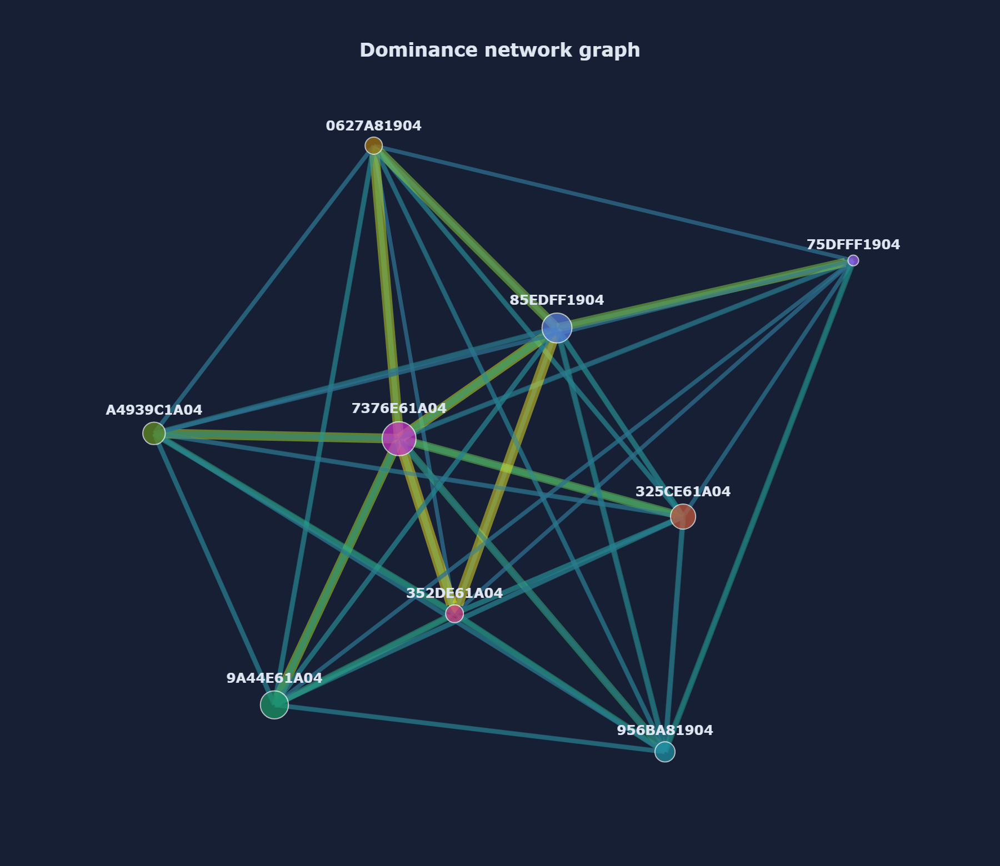

- **What it shows.** Each **node** is an animal; node **size** encodes its ranking (the final
  ordinal in the selected range — bigger = more dominant). Each **directed edge** points from
  chaser to chased, and its **width/color** encode the total number of chasing events between
  that pair over the selected range (edges are z-scored then squashed to 0–1 for width and
  Viridis color, so thicker/brighter = more chasing).
- **How to read it.** The spring layout pulls frequently-interacting animals together. Arrows
  fanning *out* of a large node mark a dominant aggressor; arrows converging *onto* a node mark
  a frequent target. Hover a node to read its ID and ranking score.
- **Responds to:** day/phase slider, Granularity. (Not Phase or Aggregation.)

### Spontaneous tube-test heatmap

A winner-vs-loser matrix of **head-on tunnel encounters**.

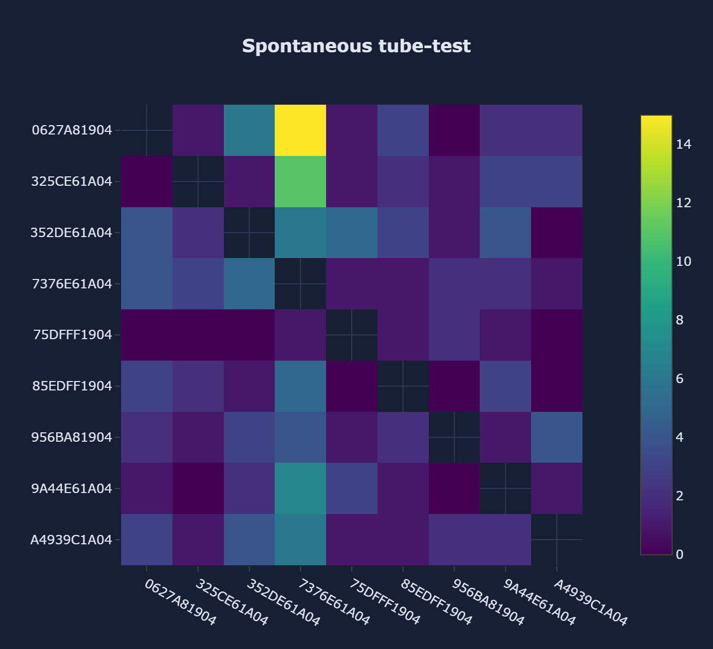

- **What it shows.** A tube-test event is a head-on meeting inside a tunnel: the loser enters
  and retreats to the cage it came from, while the winner enters the same tunnel from the
  opposite end and pushes through. The heatmap is an N×N matrix — **columns = winners, rows =
  losers** — and each cell is the sum (or mean) of tube-test wins of that winner over that
  loser.
- **How to read it.** Read a bright cell as "the column animal beat the row animal this many
  times." A column that is bright across many rows marks a consistent winner; a bright row marks
  a consistent loser. The diagonal is empty (an animal cannot beat itself). Viridis scale,
  dark = few, bright = many.
- **Responds to:** Phase, day/phase slider, Granularity, Aggregation (Sum ↔ Mean).

### Chasings heatmap

A chaser-vs-chased matrix of **chasing events**, laid out exactly like the tube-test heatmap.

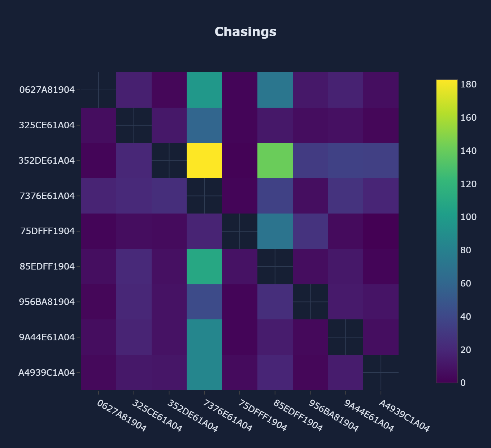

- **What it shows.** An N×N matrix — **columns = chasers, rows = chased** — where each cell is
  the sum (or mean) of chasing events from that chaser toward that chased over the selected
  range. Chasings are the broader agonistic signal that also feeds the dominance ranking, so
  this heatmap is the raw material behind the ranking and dominance-network plots.
- **How to read it.** A bright column = an animal that does a lot of the chasing; a bright row =
  an animal that gets chased a lot. Compare it against the tube-test heatmap to see whether
  general chasing and formal tunnel contests tell the same dominance story.
- **Responds to:** Phase, day/phase slider, Granularity, Aggregation (Sum ↔ Mean).

### Chasing over time

A line plot of the **diurnal rhythm of aggression** — chasing events per hour of the day.

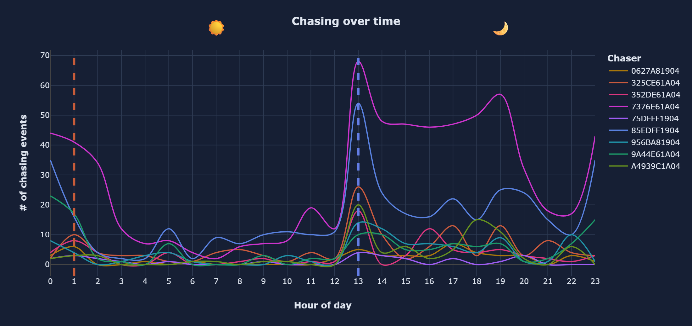

- **What it shows.** Chasing counts collapsed onto a 24-hour clock (0–23), one colored line per
  chaser. Two dashed vertical markers show the **light-phase onset** (orange, ☀️) and
  **dark-phase onset** (blue, 🌙) configured for the project.
- **How to read it.** Peaks reveal when each animal is most aggressive; because mice are
  nocturnal, expect activity to cluster around the dark phase. With **Aggregation = Mean** the
  line becomes the per-hour mean across the selected days with an **SEM shaded band**; with
  **Sum** it is the total count per hour.
- **Responds to:** day/phase slider, Granularity, Aggregation (Sum line ↔ Mean+SEM line). (The
  hour axis always spans a full 24 h regardless of Phase.)

---

## Activity

### Cage preference over time

A grid of heatmaps — **one sub-heatmap per cage** — showing how cage occupancy evolves across
the experiment.

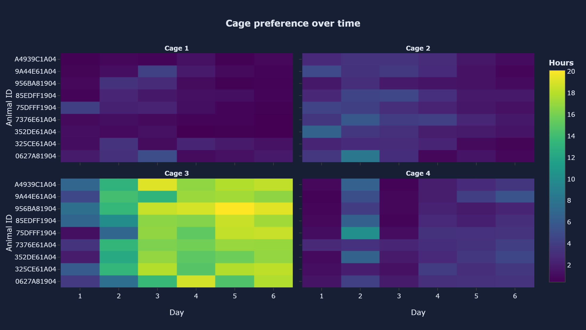

- **What it shows.** Within each cage panel, rows are animals and columns are the selected time
  units (days or phases). Cell color is the **hours spent** in that cage during that unit
  (Sum or Mean of `time_in_position`, converted to hours). Viridis scale.
- **How to read it.** Reading a row left-to-right shows how one animal's use of that cage
  changes over the experiment (e.g. an emerging preference or avoidance). Comparing the four
  cage panels shows how the cohort distributes itself across the arena.
- **Responds to:** day/phase slider, Granularity, Aggregation (Sum ↔ Mean). (Not Phase — it
  spans the whole recording.)

### Cage preference (box plot)

A cohort-level summary of **how much time is spent in each cage**, collapsed over time.

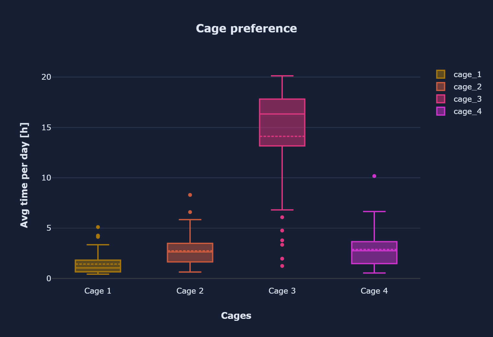

- **What it shows.** One box per cage, built from the per-animal, per-unit total hours spent in
  that cage. The box shows the median and quartiles, and the dashed mean marker (`boxmean`) the
  average; individual outlier points are shown. Hovering a point reveals which animal and unit
  it came from.
- **How to read it.** A cage with a high, tight box is uniformly popular; a wide box or many
  outliers signals that animals differ strongly in how much they use that cage. This is the
  aggregate counterpart to the time-resolved *Cage preference over time* heatmap next to it.
- **Responds to:** Phase, day/phase slider, Granularity. (Not Aggregation — always a box plot
  over the per-unit totals.)

### Activity by position (position switch)

A per-position activity plot, toggled between counts and durations by the **position switch**
(`Visits` vs. `Time`).

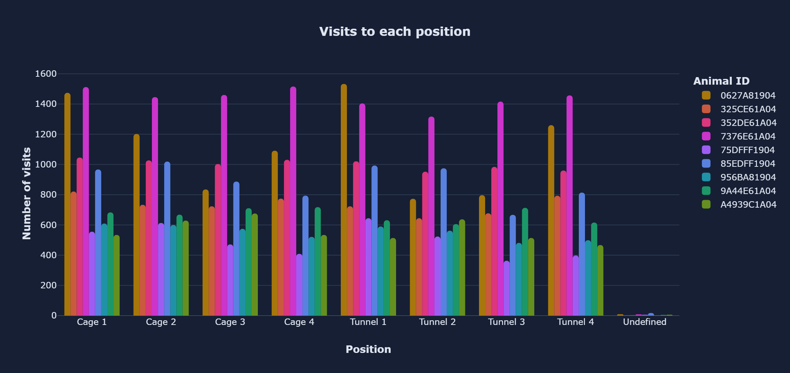

- **What it shows.** For every position (both cages and tunnels), grouped by animal:
  - **Visits** — the number of visits to that position.
  - **Time** — the total time spent (seconds) in that position.
- **How to read it.** With **Aggregation = Sum** it is a grouped **bar** chart (totals per
  animal per position); with **Mean** it becomes a grouped **box** plot showing the spread
  across the selected units, with a dashed mean marker. Use it to compare which animals are
  most active and where they concentrate their movement.
- **Responds to:** Phase, day/phase slider, Granularity, Aggregation (bars ↔ boxes), position
  switch (Visits ↔ Time).

### Activity over time

A line plot of **overall diurnal activity**, measured as raw antenna detections per hour.

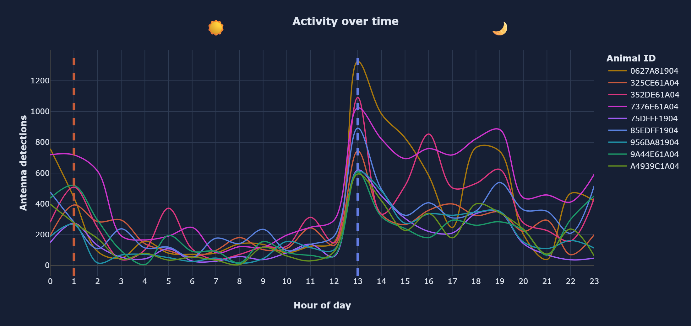

- **What it shows.** The number of antenna crossings (any antenna, any position) per hour of the
  day, one colored line per animal — a direct proxy for how much each animal is moving. Like the
  chasing-over-time plot, it carries the light-onset (☀️) and dark-onset (🌙) markers.
- **How to read it.** Peaks show each animal's active hours and reveal its circadian rhythm;
  healthy nocturnal mice peak in the dark phase. **Aggregation = Mean** draws the per-hour mean
  with an **SEM band**; **Sum** draws the hourly totals.
- **Responds to:** day/phase slider, Granularity, Aggregation (Sum line ↔ Mean+SEM line).

### Time spent per cage

A grid of heatmaps — **one panel per cage** — resolving cage occupancy across the **24-hour
day**.

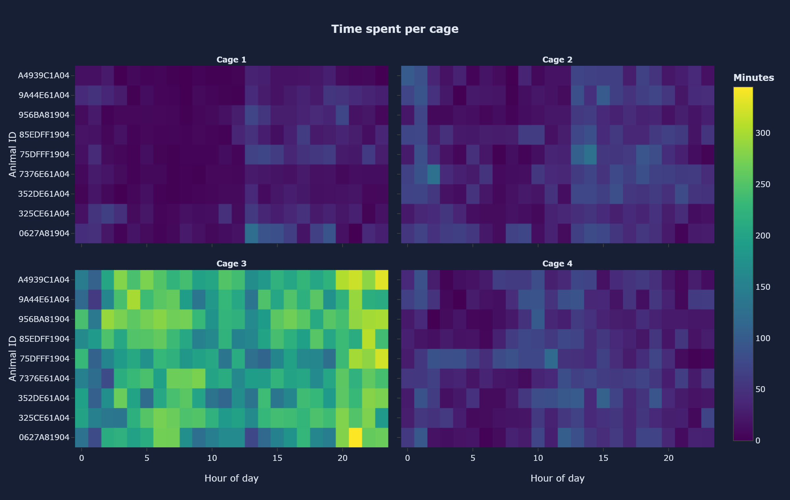

- **What it shows.** Within each cage panel, rows are animals and columns are hours of the day
  (0–23). Cell color is the **minutes spent** in that cage during that hour (Sum or Mean of
  `time_in_position`, converted to minutes). Viridis scale.
- **How to read it.** This is the hour-of-day companion to *Cage preference over time* (which
  is resolved by experiment day). Bright horizontal bands show an animal that reliably occupies
  a given cage at particular times of day — for example a preferred nesting cage used during the
  light phase.
- **Responds to:** day/phase slider, Granularity, Aggregation (Sum ↔ Mean).

---

## Sociability

### Pairwise sociability heatmaps (pairwise switch)

A grid of heatmaps — **one panel per cage** — showing how much each pair of animals interacts,
**broken down by location**. Toggled by the **pairwise switch** (`Visits` vs. `Time`).

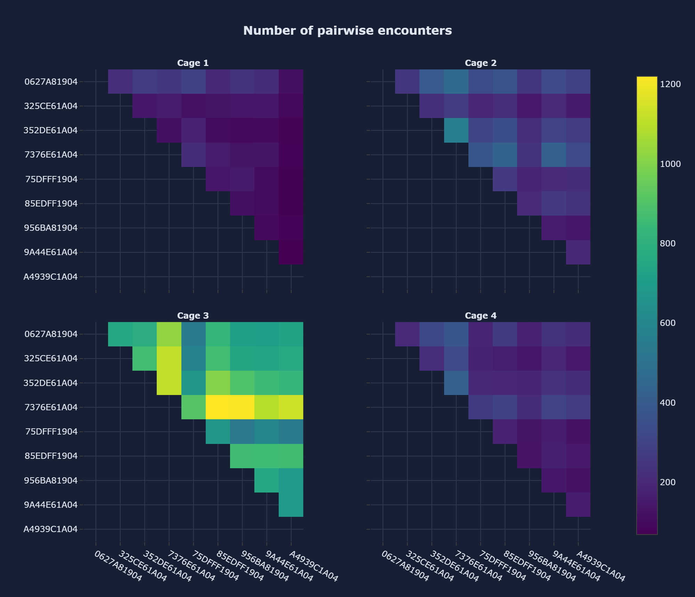

- **What it shows.** Within each cage panel, both axes list all animals, and each cell describes
  the pair at that row/column for that cage:
  - **Visits** (`pairwise_encounters`) — how many distinct co-presence encounters the pair had
    in that cage.
  - **Time** (`time_together`) — total seconds the pair spent together in that cage.
  A co-presence "meeting" requires the two animals to overlap in the same cage for at least the
  **minimum-time-together** threshold set on the Analysis page (default 2 s), and contiguous
  overlaps are stitched into a single meeting.
- **How to read it.** The matrix is symmetric (pair A–B = pair B–A) with an empty diagonal.
  Bright cells mark strongly-associating pairs; comparing panels shows *where* in the arena the
  socializing happens.
- **Responds to:** Phase, day/phase slider, Granularity, Aggregation (Sum ↔ Mean), pairwise
  switch (Visits ↔ Time).

### Sociability network graph

An undirected network summarizing **who spends time with whom** across the whole arena.

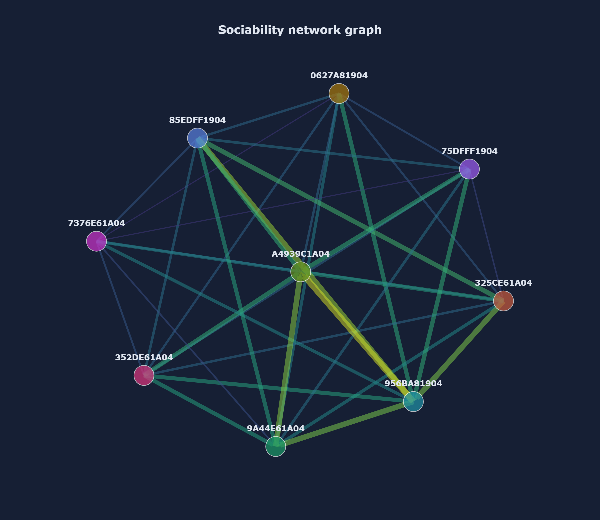

- **What it shows.** Each node is an animal; each **edge** connects a pair, weighted by their
  total **proportion of time spent together** over the selected range. Edge width/color encode
  that weight (z-scored then squashed to 0–1, Viridis). Unlike the dominance network this graph
  is **undirected** (togetherness is mutual) and node size is uniform (no ranking is applied).
- **How to read it.** Tightly-bonded pairs are pulled together by the spring layout and joined
  by thick, bright edges; loosely-associating animals drift to the periphery on thin edges. It
  is the network view of the sociability heatmaps.
- **Responds to:** day/phase slider, Granularity. (Not Phase or Aggregation.)

### Within-cohort sociability (sociability switch)

A single N×N heatmap of pairwise social bonding, toggled by the **sociability switch**
(`Time together` vs. `Incohort sociability`).

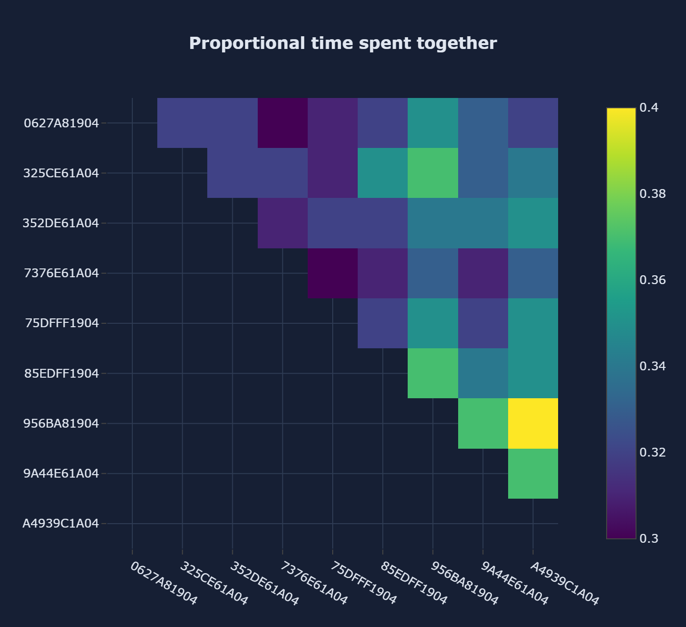

- **What it shows.** Both axes list all animals; each cell summarizes the pair's bond, averaged
  over the selected range:
  - **Time together** (`proportion_together`) — the observed fraction of phase time the pair
    spent together.
  - **Incohort sociability** (`sociability`) — the **observed-minus-chance** togetherness: the
    time a pair actually shared, minus the time they would be expected to share if each animal
    occupied cages independently (the product of their individual occupancy proportions), summed
    over cages. **Positive values mean the pair actively sought each other out**; values near
    zero mean their co-occurrence is explained by chance; negative values mean avoidance. (See
    the EcoHAB method, DOI:10.7554/eLife.19532.)
- **How to read it.** The matrix is symmetric with an empty diagonal. Under *Incohort
  sociability*, this normalization is what distinguishes a genuine social bond from two animals
  that merely happen to like the same popular cage.
- **Responds to:** Phase, day/phase slider, Granularity, sociability switch. (Not Aggregation —
  always the mean over the range.)

### Relationship stability

A scatter plot placing every pair by **how close** they are and **how consistent** that
closeness is.

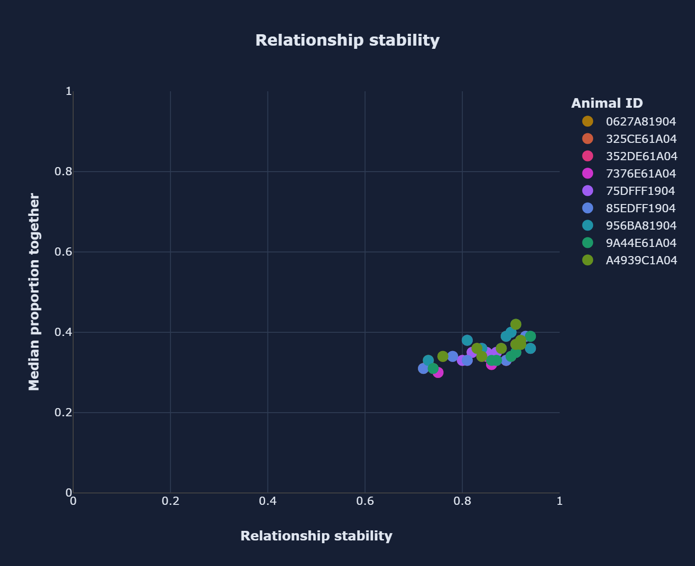

- **What it shows.** Each point is a directed pair (both A→B and B→A are plotted, colored by the
  first animal). The **y-axis is the median proportion of time together** (0–1, how bonded the
  pair is) and the **x-axis is a stability score** (0–1). Stability is derived from the median
  absolute deviation of the pair's per-unit togetherness: `1 − MAD/median`, clipped to 0–1, so
  **1 = perfectly consistent** togetherness across days and **0 = highly variable**.
- **How to read it.** The closer to the **top-right** quadrant the stronger and more consistent the relationship is, **bottom-right** = little time together consistently, **bottom-left** little time together but erratic. **top-left** is not likely as animals can't both spend a lot of time together and do it in an unstable way. Hover a point to see the partner animal.
- **Responds to:** Phase, day/phase slider, Granularity. (Not Aggregation.)

### Time spent alone

A grouped bar / box plot of how much time each animal spent **with no other animal present**,
split by cage.

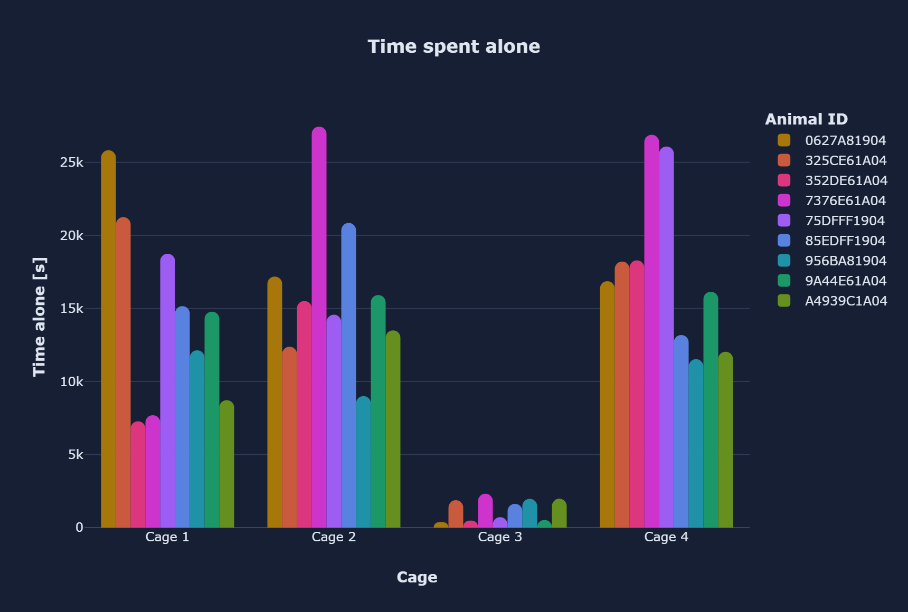

- **What it shows.** Time alone is measured per cage (tunnels are excluded) using the same
  occupancy sweep as the pairwise metrics: a stay counts as "alone" when the animal is the sole
  occupant of a cage. Bars are grouped by cage and colored by animal.
- **How to read it.** With **Aggregation = Sum** it is a grouped **bar** chart of total seconds
  alone per cage; with **Mean** it becomes a grouped **box** plot showing the spread across the
  selected units with a dashed mean marker. Tall bars flag animals (or cages) associated with
  more solitary time — a useful counterpoint to the sociability plots, since a highly social
  cohort should spend relatively little time alone.
- **Responds to:** Phase, day/phase slider, Granularity, Aggregation (bars ↔ boxes).

---

## Comparing and exporting plots

Every visualization on this page is also available in the **Plots Comparison** tab, where two
independent panels let you view any two of them side by side — the same metric across different
phases or day ranges, or two different metrics together. Each panel carries its own copy of the
settings bar and only the switches relevant to the chosen plot.

Any plot can be exported (SVG, PNG, or JSON) from the **Downloads** dialog in the settings bar;
the JSON export reopens with `plotly.io.read_json()` for further editing. The underlying result
tables can be exported as CSV from the same dialog's **DataFrames** tab. See
[The DeepEcoHab Dashboard](dashboard.md#downloading-data-and-plots) for details.
