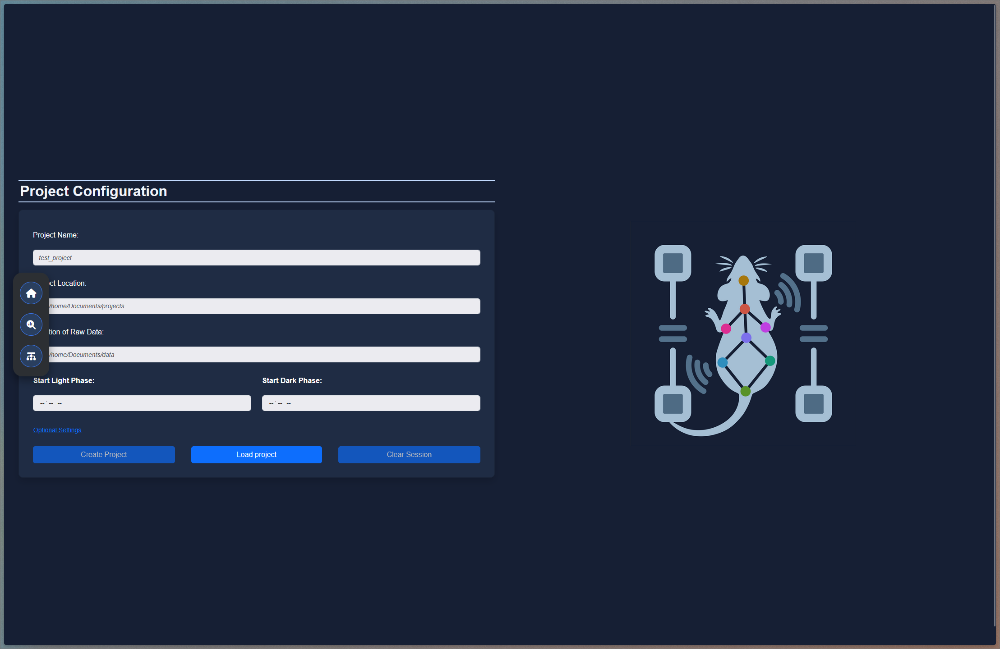
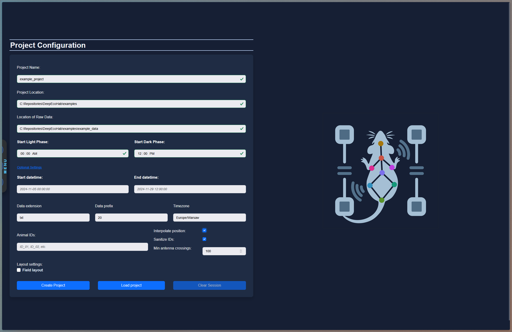
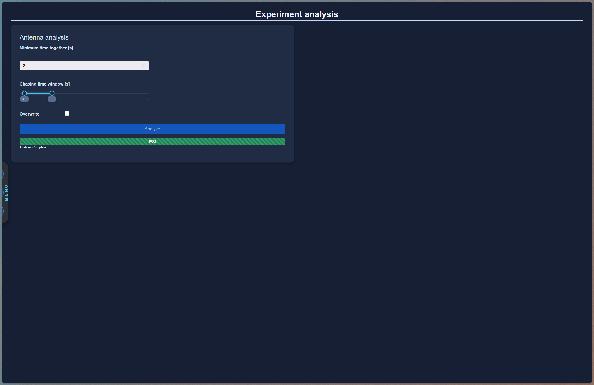
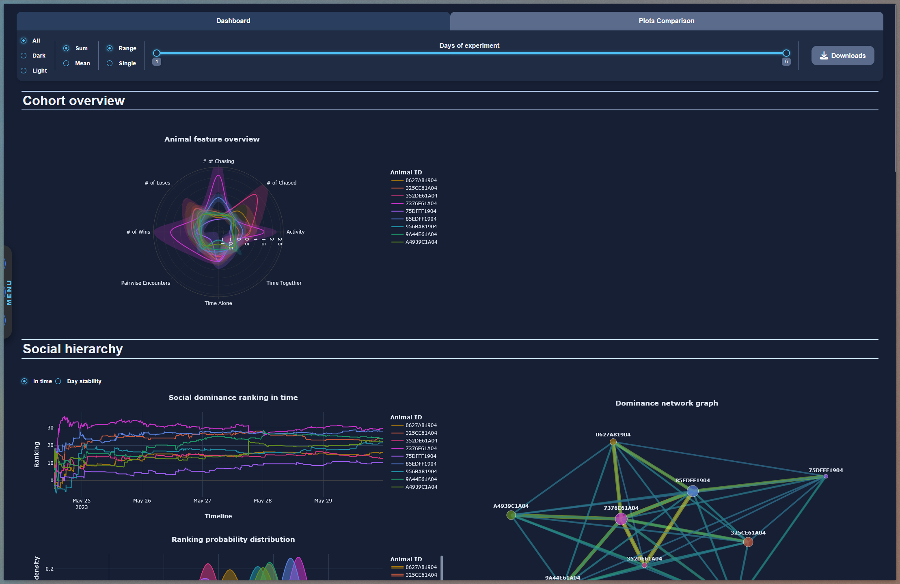
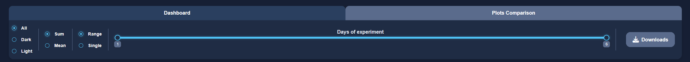
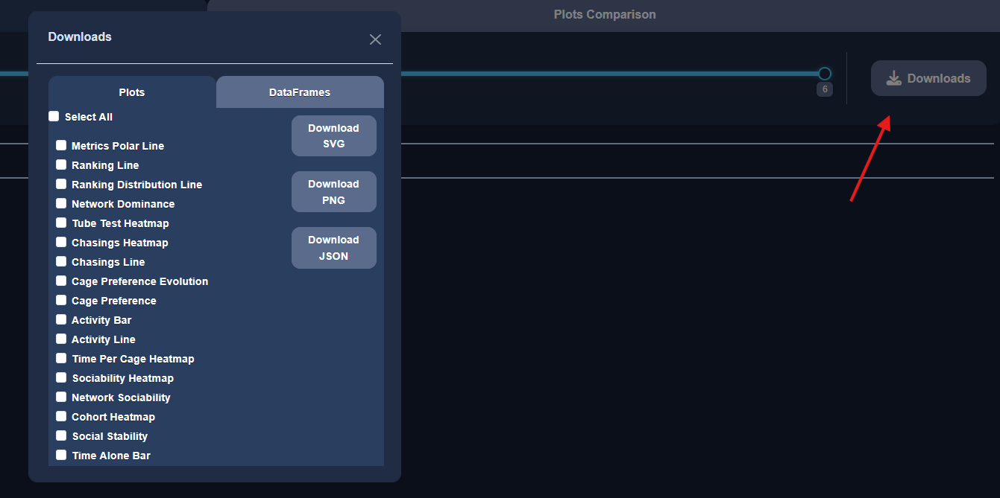
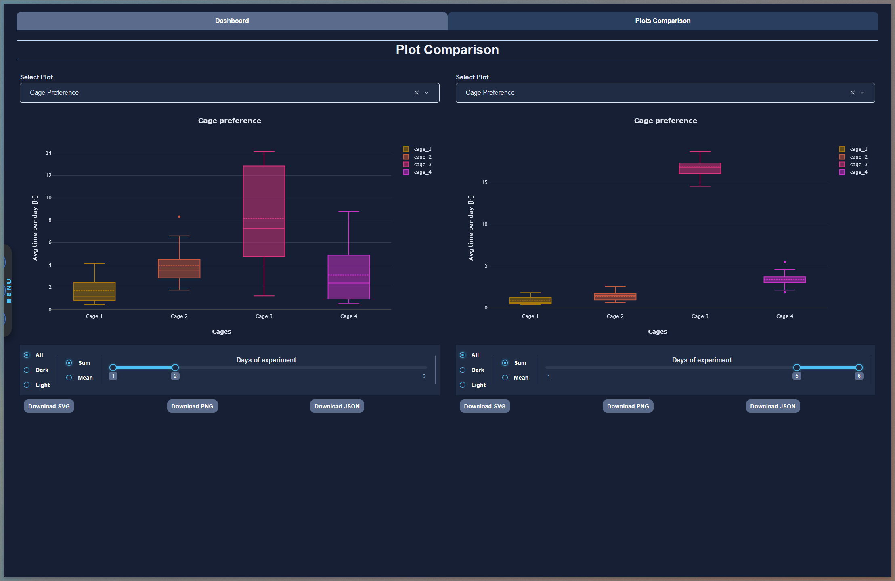

# The DeepEcoHab Dashboard

The dashboard is the interactive front-end of DeepEcoHab. It lets you create or load a
project, run the antenna analysis, and explore the results through a rich set of interactive
plots — all without writing any code. It is a multi-page [Dash](https://dash.plotly.com/)
application that runs locally in your web browser.

The dashboard is organized into three pages, reachable from the icon sidebar on the left:

| Page | Icon | Purpose |
| --- | --- | --- |
| **Home** | house | Create a new project or load an existing one. |
| **Analysis** | chart | Run the antenna (and, later, group/pose) analysis pipeline. |
| **Cohort Dashboard** | diagram | Explore and export the analysis results interactively. |



## Launching the dashboard

Installing the package registers a console script, so the dashboard can be started from any
terminal:

```
deepecohab
```

This starts a local server and automatically opens the dashboard in your default browser at
`http://127.0.0.1:8050`. A few optional flags are available:

```
deepecohab --host 127.0.0.1 --port 8050 --debug
```

- `--host` / `--port` — change the address the server binds to.
- `--debug` — enable Dash debug mode and hot-reloading (useful for development).

To stop the dashboard, return to the terminal and press `Ctrl+C`.

> **Note on sessions.** The currently loaded project is held in a browser *session store*.
> It persists while the tab is open and survives navigation between pages, but is cleared
> when you close the tab or use **Clear Session** (see below). Switching projects within a
> session should always be done via **Clear Session** to avoid mixing cached results.

---

## Home page — creating and loading projects

The Home page is where every workflow starts. You either **create** a new project from raw
acquisition data or **load** an existing project's configuration.

### Creating a new project

Fill in the required fields in the *Project Configuration* card. The **Create Project**
button stays disabled (greyed out) until every required field is valid — each field is
highlighted green when accepted and red when invalid.

**Required fields**

| Field | Description |
| --- | --- |
| **Project Name** | Name of the experiment. A folder with this name is created inside the project location. |
| **Project Location** | Directory where the project folder will be created. It is created automatically if it does not exist. |
| **Location of Raw Data** | Directory containing the raw acquisition files. Must be an existing folder. |
| **Start Light Phase** | Time of day (HH:MM) when the light phase begins. |
| **Start Dark Phase** | Time of day (HH:MM) when the dark phase begins. |

**Optional settings**

Click **Optional Settings** to expand a collapsible panel with additional configuration.
Sensible defaults are provided, so you can usually leave these untouched.

| Field | Default | Description |
| --- | --- | --- |
| **Start datetime** / **End datetime** | full recording | Crop the experiment to a specific window, e.g. `2024-11-05 00:00:00`. Leave empty to use the whole recording. |
| **Data extension** | `txt` | File extension of the raw data files. |
| **Data prefix** | `COM` | Filename prefix used to locate the correct raw files in the data folder. |
| **Timezone** | `Europe/Warsaw` | Timezone in IANA format. If omitted, the timezone of the analyzing computer is used. |
| **Animal IDs** | auto-detected | Comma-separated list of animal names (`ID_01, ID_02, ...`). Leave empty to detect them automatically from the data. |
| **Interpolate position** | off | When on, estimates position when only a single antenna reading is missing (interpolated antenna combinations). |
| **Sanitize IDs** | on | Removes ghost tags / animals with too few antenna crossings during the whole experiment. |
| **Min antenna crossings** | 100 | Threshold used when sanitizing — tags with fewer crossings are discarded. Only editable when **Sanitize IDs** is enabled. |
| **Field layout** | off | Enable for the field-EcoHab layout (also treated as a custom layout). Leave off for the standard four-cage layout. |



When you press **Create Project**, the dashboard:

1. Creates the project directory and writes a `config.toml`.
2. Builds the EcoHab data structure from the raw files (applying sanitization,
   interpolation, etc.).
3. Loads the resulting configuration into the active session.

A toast notification appears in the lower part of the card reporting the outcome:

- **Success** (green) — the project was created at the shown path.
- **Warning** (orange) — a project already existed at that path; the existing one was loaded.
- **Error** (red) — creation failed; the message describes the problem and the button changes
  to *Try Again*.

The button itself shows a spinner while the data structure is being built, so for large
experiments expect a short wait before the toast appears.

### Loading an existing project

If you have already created a project, you do not need to rebuild it. Click **Load project**
to open the *Upload config* dialog and drag-and-drop (or browse for) the project's
`config.toml`. Once loaded, a success toast confirms the project is active for the session,
and you can move straight to the **Cohort Dashboard** (assuming the analysis has already been
run for that project).

### Clearing the session

**Clear Session** resets the active project and clears the analysis cache. It is disabled
until a project is loaded. Use it before loading a different project to make sure no cached
results from the previous project carry over.

---

## Analysis page — running the pipeline

The Analysis page runs the computational pipeline that turns the raw data structure into all
the tables the dashboard plots are built from.

### Antenna analysis controls

| Control | Default | Description |
| --- | --- | --- |
| **Minimum time together [s]** | 2 | Minimum overlap (in seconds) for two animals to count as being "together" in pairwise/sociability metrics. |
| **Chasing time window [s]** | 0.1 – 1.2 | Range slider defining the time window (in seconds) used to classify one animal chasing another. |
| **Overwrite** | off | When enabled, recomputes and overwrites previously saved results instead of reusing them. |

The **Analyze** button is disabled until a project is loaded on the Home page. When pressed,
the pipeline runs step by step and a striped progress bar reports the current step and
percentage complete. When it reaches 100% the bar turns green and shows *Analysis Complete*,
and the freshly computed results are loaded into the session cache ready for the dashboard.



---

## Cohort Dashboard page

This is the main exploration surface. Once a project is loaded **and** its analysis has been
run, the page renders a full set of interactive plots grouped into thematic sections. If no
project is loaded you will instead see *"Please load a project to see graphs."*

The page has two tabs:

- **Dashboard** — the full, sectioned overview of the cohort.
- **Plots Comparison** — two independent panels for comparing any two plots side by side.



### The settings bar (global controls)

A settings bar stays pinned at the top of the Dashboard tab. The controls here apply
globally and update only the plots that depend on the changed setting (plots that don't use a
given control are left untouched, so the page stays responsive).

| Control | Options | What it does |
| --- | --- | --- |
| **Phase** | All / Dark / Light | Restricts the data to the dark phase, the light phase, or both combined. |
| **Aggregation** | Sum / Mean | Whether per-hour values are summed or averaged across the selected days. Disabled in *Single* day mode. |
| **Slider mode** | Range / Single | Switches the day selector between a two-handled range slider and a single-day slider. |
| **Days of experiment** | slider | Selects which experiment day(s) the plots cover. In *Range* mode pick a start and end day; in *Single* mode pick one day. |
| **Downloads** | button | Opens the Downloads dialog (see below). |



### Per-section switches

Several sections have their own radio switches placed just above the relevant plots. These
toggle *what* a plot shows rather than the global slice of data:

- **Social hierarchy → ranking switch**: *In time* (ranking evolution over time) vs.
  *Day stability* (per-day rank stability).
- **Activity → position switch**: *Visits* (number of visits) vs. *Time* (time spent).
- **Sociability → pairwise switch**: *Visits* (pairwise encounters) vs. *Time* (time together).
- **Sociability → sociability switch**: *Time together* (proportion of time together) vs.
  *Incohort sociability*.

### Plot sections

The Dashboard tab is organized top-to-bottom into the following sections:

1. **Cohort overview** — a polar/line summary of the key cohort metrics.
2. **Social hierarchy** — ranking line, ranking distribution, a dominance network graph, and
   tube-test / chasings heatmaps plus a chasings line.
3. **Activity** — cage-preference evolution and totals, activity bar and line plots, and a
   time-per-cage heatmap.
4. **Sociability** — pairwise/sociability heatmaps, a sociability network graph, cohort
   heatmap, social stability, and a time-alone bar.

Each plot is interactive (hover for values, zoom, pan). A spinner is shown while a plot is
recomputing.

### Downloading data and plots

The **Downloads** button in the settings bar opens a dialog with two tabs:

- **Plots** — tick the plots you want and choose a format (**SVG**, **PNG**, or **JSON**).
  Use **Select All** to grab everything. A single selection downloads one file; multiple
  selections are bundled into a ZIP. The JSON export can be re-opened with
  `plotly.io.read_json()` for further editing.
- **DataFrames** — tick one or more result tables and click **Download DataFrame/s** to
  export them as CSV (bundled into a ZIP when multiple are selected). Exports respect the
  current **Phase** and **Days** selection where those columns exist.



### Plots Comparison tab

The **Plots Comparison** tab shows two independent panels (left and right). In each panel you:

1. Pick any available plot from the **Select Plot** dropdown.
2. Adjust that panel's own settings bar (phase, aggregation, day range, and whichever
   per-plot switches are relevant — irrelevant switches are hidden automatically).
3. Optionally download that single panel's plot as SVG, PNG, or JSON.

Because the two panels are fully independent, this tab is ideal for comparing the same metric
across different phases or day ranges, or two different metrics side by side.



---

## Typical workflow

1. Launch the dashboard with `deepecohab`.
2. On **Home**, either create a new project from raw data or load an existing `config.toml`.
3. Go to **Analysis** and run the antenna analysis (adjust the minimum-time and
   chasing-window parameters if needed).
4. Open the **Cohort Dashboard** to explore the results, using the settings bar and
   per-section switches to slice the data.
5. Export any plots or tables you need from the **Downloads** dialog.
6. Use **Clear Session** on Home before switching to a different project.
